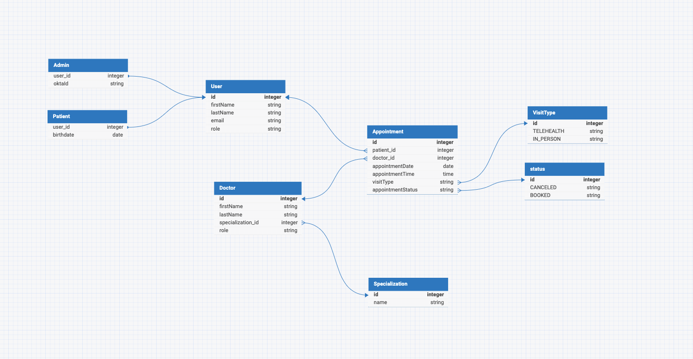

# Med Booking Application

## Overview

The Med Booking Application is a web-based platform designed to facilitate the booking and management of medical appointments. It consists of a frontend built with React and a backend powered by Spring Boot. The application supports user authentication via Okta and provides functionalities for patients and administrators to manage appointments and doctor information.

## Environment Setup

### Frontend

1. Navigate to the frontend directory:

   ```sh
   cd med-booking-frontend
   ```

2. Install the dependencies:

   ```sh
   npm install
   ```

3. Start the development server:
   ```sh
   npm start
   ```

### Backend

1. Navigate to the backend directory:

   ```sh
   cd med-booking-backend
   ```

2. Duplicate the `application.properties.example` file and rename it to `application.properties`:

   ```sh
   cp src/main/resources/application.properties.example src/main/resources/application.properties
   ```

3. Set up the environment variables in an .env file in the ROOT directory.

```properties

# PostgreSQL Database Configuration
POSTGRES_DB=med-booking-database ## your_databse_name
POSTGRES_USER=postgres  ## your_databse_username
POSTGRES_PASSWORD=password123  ## your_databse_password

# Spring Boot Configuration
SPRING_DATASOURCE_URL=jdbc:postgresql://postgres:5432/med-booking-database  ## your_databse_name
SPRING_DATASOURCE_USERNAME=postgres    ## your_databse_username
SPRING_DATASOURCE_PASSWORD=password123    ## your_databse_password

# Okta Configuration
OKTA_OAUTH2_ISSUER=https://dev-60111992.okta.com/oauth2/default
OKTA_OAUTH2_CLIENT_ID=0oaljqjczlQ1bN7ZI5d7
OKTA_OAUTH2_CLIENT_SECRET=W2YgKwUTgqAKHSnTZHL1Y7_OJDf4xfiSSALGUah52pAx_YgvX5qVBU8q6S-qROY1

```

4. Add your Okta details to the `application.properties` file:

   ```properties

   ```

# application.properties file

# Database settings

spring.datasource.url=${SPRING_DATASOURCE_URL}
spring.datasource.username=${SPRING_DATASOURCE_USERNAME}
spring.datasource.password=${SPRING_DATASOURCE_PASSWORD}
spring.jpa.hibernate.ddl-auto=update
spring.jpa.show-sql=true
spring.jpa.properties.hibernate.dialect=org.hibernate.dialect.PostgreSQLDialect
spring.jpa.properties.hibernate.format_sql=true
server.error.include-message=always

# Okta settings

okta.oauth2.issuer=${OKTA_OAUTH2_ISSUER}
okta.oauth2.client-id=${OKTA_OAUTH2_CLIENT_ID}
okta.oauth2.client-secret=${OKTA_OAUTH2_CLIENT_SECRET}
okta.oauth2.scopes=openid,profile,offline_access

````

5. Run the backend server:
```sh
./mvnw spring-boot:run
````

### Running with Docker

To be implemented

## Okta Setup

### Creating App

Create a new app integration with the following settings:

- OIDC
- Web application
- Name your app
- Change Sign-in redirect URIs to: `http://localhost:8080/login/oauth2/code/okta`
- Sign-out redirect URIs to include both: `http://localhost:8080` & `http://localhost:3000`
- For controlled access check: "Allow everyone in your organization to access"
- Leave everything default
- Adjust Okta security settings based on your needs but this gives you quick access to test your app with Okta

### API Security

- Follow Okta API security steps

## Database Schema

The database schema includes the following tables:

- **users**: Stores user information including id, first name, last name, email, and role.
- **admins**: Stores admin-specific information.
- **patients**: Stores patient-specific information including birthdate.
- **doctors**: Stores doctor information including specialization.
- **specializations**: Stores medical specializations.
- **appointments**: Stores appointment details including patient, doctor, date, time, visit type, and status.



## API Endpoints

For detailed API endpoint examples, refer to the API Examples documentation.

[Database Schema](./API_ENDPOINTS.md)
